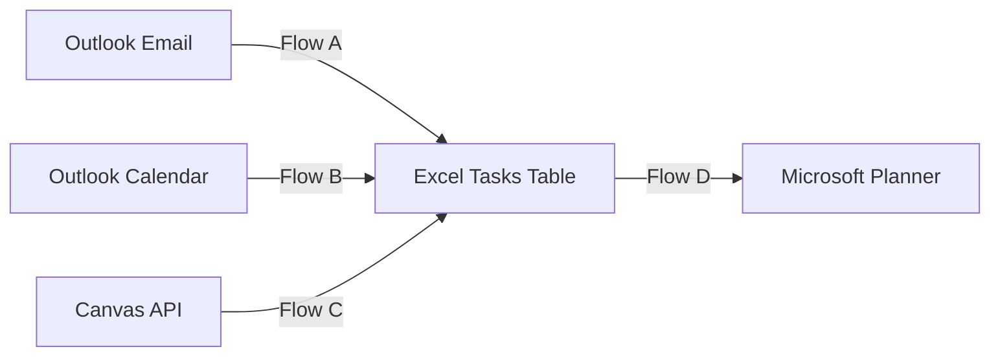

# Automated Tasks Integration Project

This project automates capturing tasks from multiple sources:

- Outlook emails  
- Outlook calendar events  
- Canvas LMS assignments  
- …into a master Excel task table  
- …then into Microsoft Planner tasks

Once everything is wired up, Planner becomes your “single pane of glass” for all school tasks, while Excel is the central source of truth.

---

## 🧱 Architecture Overview



---

## 📁 Repo Structure

```
Automated_Tasks_Project/
│
├── README.md
│
├── excel/
│   └── Student_Tasks_Template.xlsx
│
├── flows/
│   ├── FlowA_Outlook_to_Excel.md
│   ├── FlowB_Calendar_to_Excel.md
│   ├── FlowC_CanvasAPI_to_Excel.md
│   └── FlowD_Excel_to_Planner.md
│
├── canvas_api/
│   ├── Canvas_API_Setup.md
│   ├── example_canvas_json.json
│   └── ParseJSON_Schema.json
│
└── reference/
    ├── Excel_Table_Design.md
    ├── PowerAutomate_Tips.md
    └── Troubleshooting.md
```

---

## 📊 Excel Master Task Table

**Template:** `excel/Student_Tasks_Template.xlsx`  
**Live file:** Must live in OneDrive or SharePoint.

### **Table name:**
```
Tasks
```

### Key columns (see reference/Excel_Table_Design.md):

- TaskId – unique ID (`OUTLOOK-…`, `CAL-…`, `CANVAS-…`)
- Title – short task title  
- Description – detailed text  
- Checklist – parsed multi-line sub-tasks  
- StartDate – parsed or fallback to `utcNow()`  
- DueDate – deadline timestamp  
- Source – Outlook / Calendar / Canvas  
- SourceId – unique ID from the source  
- Course – course name/code  
- Status – `New`, `Pushed_to_Planner`, `Archived`  
- CreatedOn – timestamp when row was created  

---

## ⚙️ Flows

### FlowA_Outlook_to_Excel.md
- Trigger: new email  
- Filters relevant messages  
- Builds TaskId, StartDate, DueDate, Checklist  
- Inserts into Excel with Source = Outlook  

### FlowB_Calendar_to_Excel.md
- Trigger: event added/updated  
- Uses event start/end as StartDate/DueDate  
- Upserts into Excel with Source = Calendar  

### FlowC_CanvasAPI_to_Excel.md
- Trigger: recurrence  
- Calls Canvas API  
- Uses unlock_at as StartDate, due_at as DueDate  
- Upserts into Excel with Source = Canvas  

### FlowD_Excel_to_Planner.md
- Trigger: recurrence  
- Selects rows where Status = New  
- Creates Planner tasks  
- Builds checklists from Excel `Checklist` column  
- Sets Status = Pushed_to_Planner  

---

## 🌐 Canvas API

Docs and helper files in `/canvas_api`:

- Canvas_API_Setup.md  
- example_canvas_json.json  
- ParseJSON_Schema.json  

---

## 📚 Reference Docs

In `/reference`:

- Excel_Table_Design.md  
- PowerAutomate_Tips.md  
- Troubleshooting.md  

---

## 🚀 How to Use This Project

1. Deploy Excel template into OneDrive/SharePoint.  
2. Build all flows using `/flows`.  
3. Configure Canvas API.  
4. Test each flow individually.  
5. Turn all flows on.

### After setup:

**Outlook + Calendar + Canvas → Excel → Planner**

Excel `Status` controls which rows get pushed to Planner.

Planner becomes your unified student task board.

---
